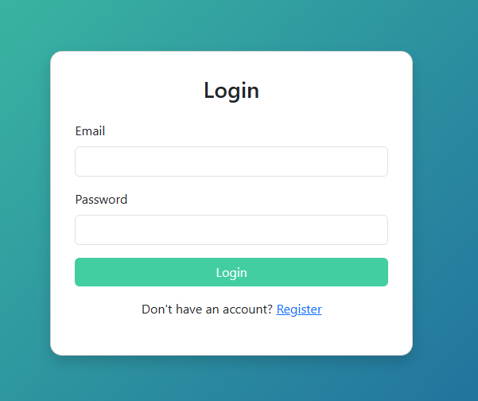

# J2_UI_Demo
Demo for Register, Login and Dashboard!!

  

<h1 align="center">Course Enrollment System</h1>

A web application for managing course registrations.

  
  

# Technology
- HTML
- CSS
- Bootstrap (BS5)

📷 Screen Shot
# Register

# Login

